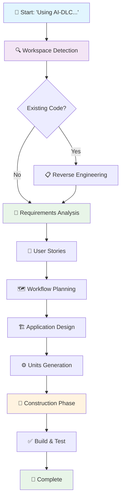
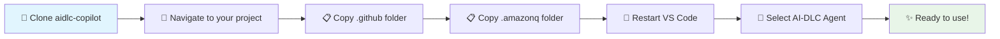
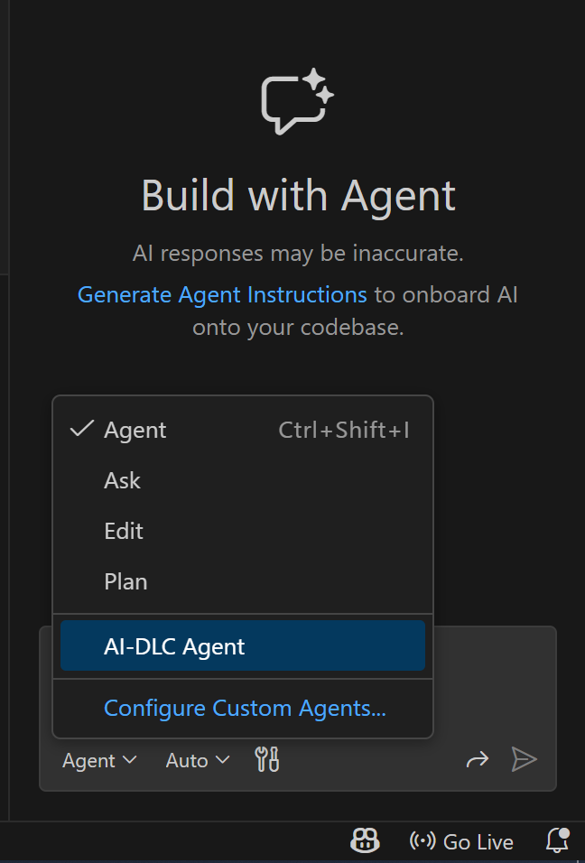
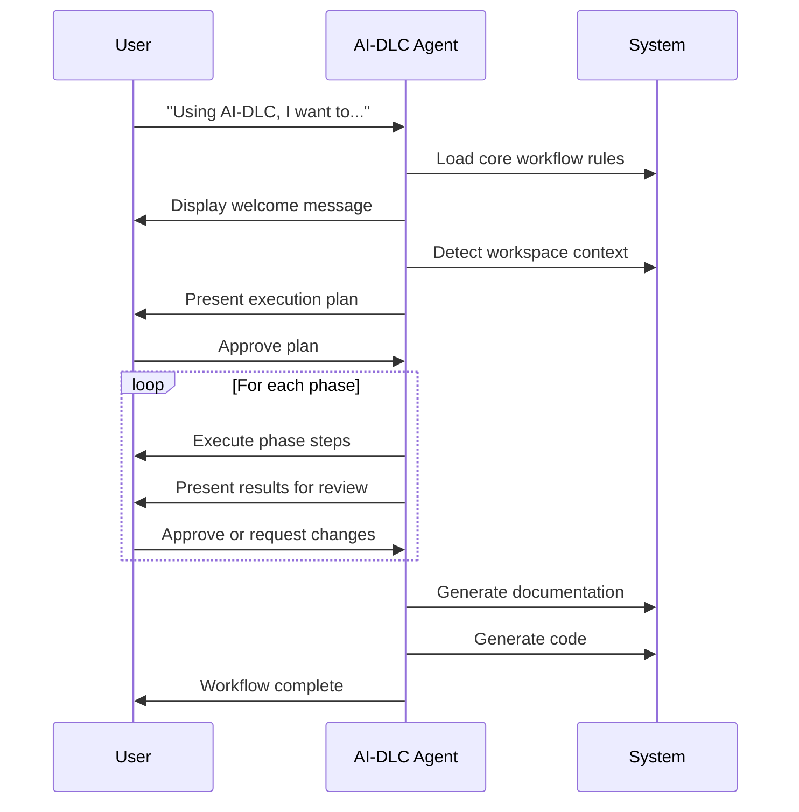

# AI-DLC for GitHub Copilot

AI-DLC (AI-Driven Development Life Cycle) integration for GitHub Copilot using custom agents. This repository provides the necessary configuration to use AI-DLC methodology with GitHub Copilot's agent system in VS Code.

## What is AI-DLC?

AI-DLC is an intelligent software development workflow that adapts to your needs, maintains quality standards, and keeps you in control of the process. It follows a structured three-phase approach:

- **🔵 INCEPTION PHASE**: Determines **WHAT** to build and **WHY**
- **🟢 CONSTRUCTION PHASE**: Determines **HOW** to build it  
- **🟡 OPERATIONS PHASE**: Deployment and monitoring (future)

For more details, read the [AI-DLC blog](https://aws.amazon.com/blogs/devops/ai-driven-development-life-cycle/) and [Method Definition Paper](https://prod.d13rzhkk8cj2z0.amplifyapp.com/).

### AI-DLC Workflow Overview



## Prerequisites

- VS Code with [GitHub Copilot extension](https://marketplace.visualstudio.com/items?itemName=GitHub.copilot) installed
- GitHub Copilot subscription

## Setup

1. **Clone this repository** to your local machine:
   ```bash
   git clone <this-repo-url>
   ```

2. **Copy AI-DLC files** to your project workspace:
   ```bash
   # Navigate to your project directory
   cd <your-project>
   
   # Copy the .github folder (for Copilot agent)
   cp -R ../aidlc-copilot/.github .
   
   # Copy the .amazonq folder (contains AI-DLC rules)
   cp -R ../aidlc-copilot/.amazonq .
   ```

3. **Restart VS Code** to ensure the agent is loaded properly.

### Setup Flow



## Usage

### Selecting the AI-DLC Agent

1. Open GitHub Copilot Chat in VS Code
2. Click on the **Agent** dropdown (shows "Agent ✓" by default)
3. Select **"AI-DLC Agent"** from the list



### Starting an AI-DLC Session

Once you've selected the AI-DLC Agent, start any software development project with a prompt beginning with **"Using AI-DLC"**:

#### Sample Prompts

**For a new web application:**
```
Using AI-DLC, I want to create a task management web application with user authentication, task creation, editing, and deletion features. Users should be able to organize tasks into projects and set due dates.
```

**For enhancing an existing system:**
```
Using AI-DLC, I need to add a notification system to my existing e-commerce application. Users should receive email notifications for order confirmations, shipping updates, and promotional offers.
```

**For a microservice:**
```
Using AI-DLC, I want to build a user profile microservice that handles user registration, authentication, profile management, and integrates with external OAuth providers like Google and GitHub.
```

**For a data processing system:**
```
Using AI-DLC, I need to create a data pipeline that processes CSV files, validates the data, transforms it according to business rules, and stores it in a database with error handling and logging.
```

### What Happens Next

1. **AI-DLC activates automatically** and displays a welcome message
2. **Workspace detection** runs to understand your project context
3. **Structured questions** guide you through requirements gathering
4. **Execution plan** is presented for your review and approval
5. **Phase-by-phase execution** with your oversight at each stage
6. **Documentation and code** generated in organized directories

### AI-DLC Execution Flow



### Key Features

- **Adaptive Intelligence**: Only executes stages that add value
- **Context-Aware**: Analyzes existing codebase and complexity
- **Risk-Based**: Complex changes get comprehensive treatment
- **Question-Driven**: Structured multiple-choice questions
- **Always in Control**: Review and approve each phase

## Directory Structure

After running AI-DLC, your project will have:

```
<your-project>/
├── .github/agents/          # GitHub Copilot agent configuration
├── .amazonq/               # AI-DLC rules and methodology
├── aidlc-docs/            # Generated documentation
│   ├── inception/         # Requirements, design, planning
│   ├── construction/      # Detailed design, code plans
│   ├── aidlc-state.md    # Workflow progress tracking
│   └── audit.md          # Complete interaction history
└── [your application code] # Generated in workspace root
```

## Tips for Best Results

1. **Be specific** in your initial request - include business context and key requirements
2. **Review carefully** - AI-DLC will ask for approval at each major stage
3. **Answer questions thoroughly** - the structured questions help ensure quality
4. **Provide feedback** - you can request changes at any stage
5. **Trust the process** - AI-DLC adapts complexity to your needs

## Troubleshooting

**Agent not appearing in dropdown:**
- Restart VS Code
- Ensure `.github/agents/aidlc.md` exists in your project
- Check that GitHub Copilot extension is active

**AI-DLC not activating:**
- Start your prompt with "Using AI-DLC"
- Ensure `.amazonq/` folder is copied to your project
- Verify the AI-DLC Agent is selected in Copilot Chat

## Support

For issues or questions about AI-DLC methodology, refer to the [original AI-DLC repository](https://github.com/aws-samples/aidlc-workflows) or the methodology documentation.

## License

This project is licensed under the MIT-0 License - see the LICENSE file for details.