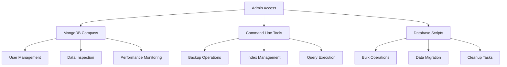
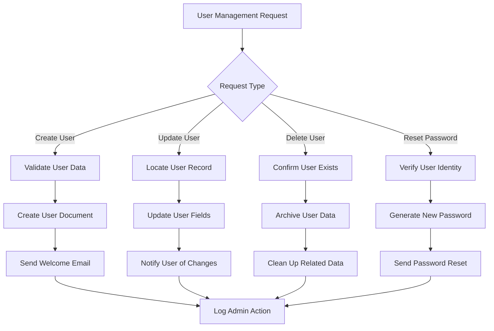
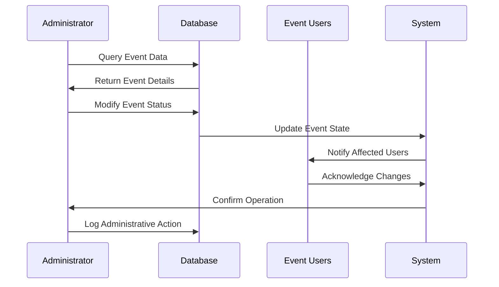
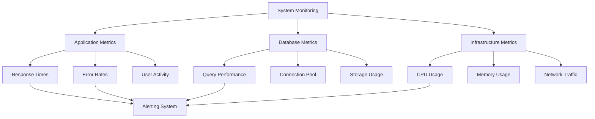
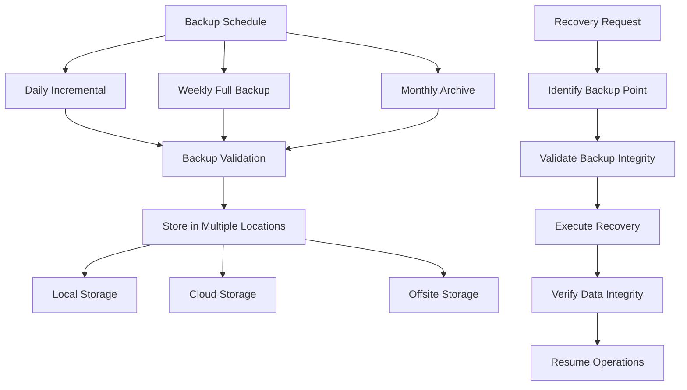
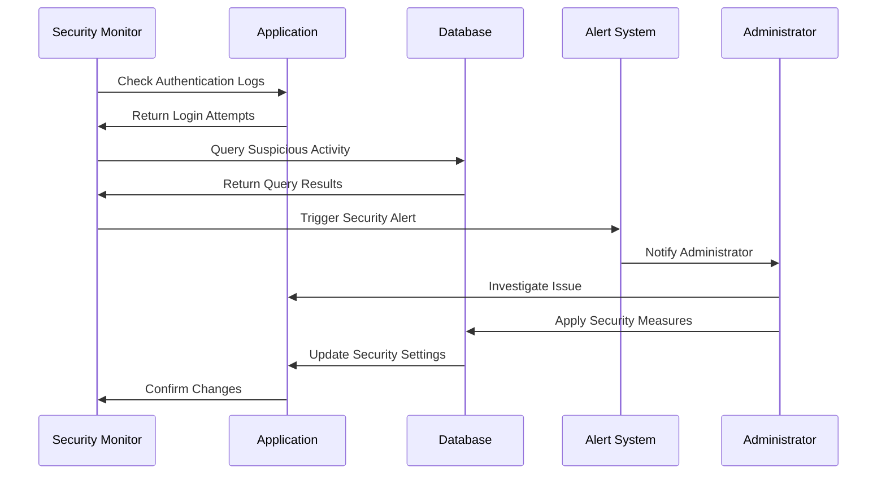
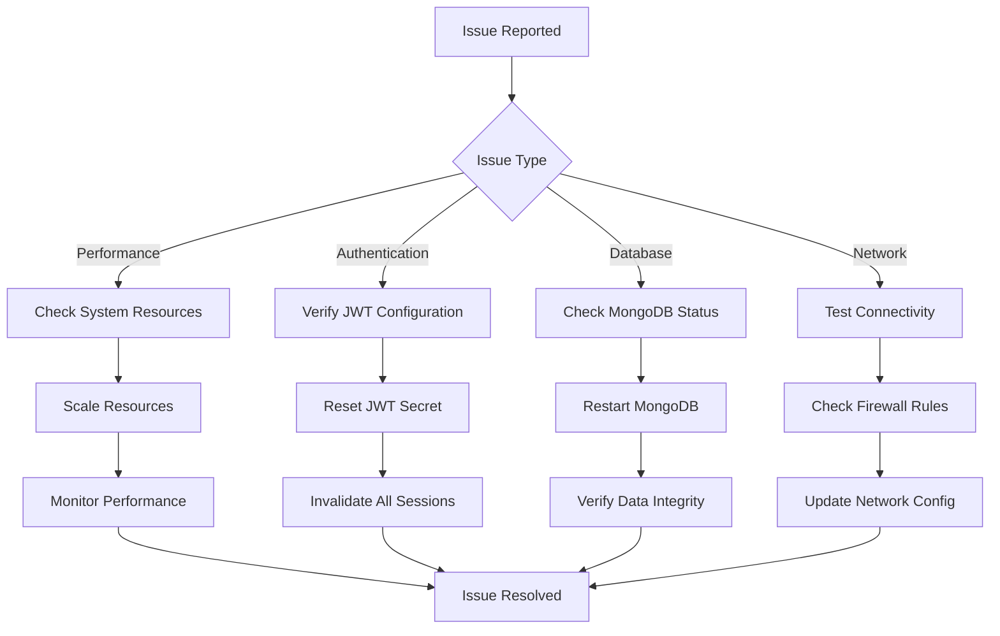
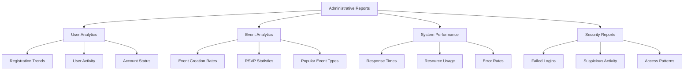

# Administrator Guide - Event Planning Application

## Overview

This guide provides comprehensive information for system administrators managing the Event Planning Application, including user management, system monitoring, maintenance procedures, and troubleshooting.

## Administrative Access

### Admin Dashboard Access
- **URL**: `https://yourdomain.com/admin` (when implemented)
- **Current Access**: Direct database access via MongoDB tools
- **Authentication**: Database-level authentication required

### Database Administration



## User Management

### User Administration Workflow



### User Management Commands

#### View All Users
```javascript
// MongoDB shell commands
use eventplanning

// List all users
db.users.find({}, {password: 0}).pretty()

// Count total users
db.users.countDocuments()

// Find users by email pattern
db.users.find({email: /gmail.com$/})
```

#### Create Admin User
```javascript
// Create administrative user
db.users.insertOne({
    email: "admin@eventplanning.com",
    name: "System Administrator",
    password: "$2a$10$hashedPasswordHere",
    role: "ADMIN",
    createdAt: new Date(),
    isActive: true
})
```

#### User Account Operations
```javascript
// Disable user account
db.users.updateOne(
    {email: "user@example.com"},
    {$set: {isActive: false, disabledAt: new Date()}}
)

// Reset user password (requires new hash)
db.users.updateOne(
    {email: "user@example.com"},
    {$set: {password: "$2a$10$newHashedPasswordHere"}}
)

// Delete user and related data
db.users.deleteOne({email: "user@example.com"})
db.events.deleteMany({organizerId: "userId"})
db.tasks.deleteMany({assigneeId: "userId"})
```

## Event Management

### Event Administration Workflow



### Event Administration Commands

#### Event Overview
```javascript
// Get event statistics
db.events.aggregate([
    {
        $group: {
            _id: null,
            totalEvents: {$sum: 1},
            activeEvents: {
                $sum: {
                    $cond: [{$gte: ["$dateTime", new Date()]}, 1, 0]
                }
            }
        }
    }
])

// Events by organizer
db.events.aggregate([
    {
        $group: {
            _id: "$organizerId",
            eventCount: {$sum: 1}
        }
    },
    {$sort: {eventCount: -1}}
])
```

#### Event Moderation
```javascript
// Find events requiring review
db.events.find({
    $or: [
        {name: /inappropriate_keyword/i},
        {description: /spam_pattern/i}
    ]
})

// Disable problematic event
db.events.updateOne(
    {_id: ObjectId("eventId")},
    {
        $set: {
            isActive: false,
            moderationStatus: "DISABLED",
            moderatedBy: "admin@eventplanning.com",
            moderatedAt: new Date()
        }
    }
)

// Bulk update event status
db.events.updateMany(
    {dateTime: {$lt: new Date(Date.now() - 30*24*60*60*1000)}},
    {$set: {status: "ARCHIVED"}}
)
```

## System Monitoring

### Performance Monitoring Dashboard



### Monitoring Commands

#### Application Health
```bash
# Check backend health
curl -f http://localhost:8080/actuator/health || echo "Backend unhealthy"

# Check frontend availability
curl -f http://localhost:3000 || echo "Frontend unavailable"

# Check database connectivity
mongo --eval "db.adminCommand('ping')" || echo "Database unreachable"
```

#### Database Performance
```javascript
// Check database statistics
db.stats()

// Monitor slow queries
db.setProfilingLevel(2, {slowms: 100})
db.system.profile.find().sort({ts: -1}).limit(5)

// Check index usage
db.events.aggregate([{$indexStats: {}}])

// Monitor connections
db.serverStatus().connections
```

#### System Resource Monitoring
```bash
# Monitor system resources
top -p $(pgrep -f "eventplanning")

# Check disk usage
df -h /var/lib/mongodb

# Monitor network connections
netstat -tulpn | grep :8080
netstat -tulpn | grep :27017
```

## Data Management

### Data Backup and Recovery



### Backup Operations

#### Manual Backup
```bash
#!/bin/bash
# Manual backup script

BACKUP_DATE=$(date +%Y%m%d_%H%M%S)
BACKUP_DIR="/backups/eventplanning"

# Create backup directory
mkdir -p $BACKUP_DIR

# Backup database
mongodump --host localhost:27017 --db eventplanning --out $BACKUP_DIR/$BACKUP_DATE

# Compress backup
tar -czf $BACKUP_DIR/eventplanning_$BACKUP_DATE.tar.gz -C $BACKUP_DIR $BACKUP_DATE

# Verify backup
if [ -f "$BACKUP_DIR/eventplanning_$BACKUP_DATE.tar.gz" ]; then
    echo "Backup completed successfully: $BACKUP_DIR/eventplanning_$BACKUP_DATE.tar.gz"
else
    echo "Backup failed!"
    exit 1
fi
```

#### Data Recovery
```bash
#!/bin/bash
# Recovery script

BACKUP_FILE="$1"
RECOVERY_DB="eventplanning_recovery"

if [ -z "$BACKUP_FILE" ]; then
    echo "Usage: $0 <backup_file.tar.gz>"
    exit 1
fi

# Extract backup
tar -xzf $BACKUP_FILE -C /tmp/

# Restore to recovery database
mongorestore --host localhost:27017 --db $RECOVERY_DB /tmp/eventplanning/

echo "Data restored to database: $RECOVERY_DB"
```

### Data Cleanup and Maintenance

#### Automated Cleanup Tasks
```javascript
// Clean up expired events (older than 1 year)
db.events.deleteMany({
    dateTime: {$lt: new Date(Date.now() - 365*24*60*60*1000)}
})

// Remove orphaned RSVPs
var eventIds = db.events.distinct("_id")
db.rsvps.deleteMany({
    eventId: {$nin: eventIds.map(id => id.toString())}
})

// Clean up completed tasks (older than 6 months)
db.tasks.deleteMany({
    status: "COMPLETED",
    dueDate: {$lt: new Date(Date.now() - 180*24*60*60*1000)}
})

// Archive old user sessions
db.sessions.deleteMany({
    lastAccessed: {$lt: new Date(Date.now() - 30*24*60*60*1000)}
})
```

## Security Administration

### Security Monitoring Workflow



### Security Commands

#### Authentication Monitoring
```javascript
// Monitor failed login attempts
db.authLogs.find({
    action: "LOGIN_FAILED",
    timestamp: {$gte: new Date(Date.now() - 24*60*60*1000)}
}).sort({timestamp: -1})

// Find suspicious IP addresses
db.authLogs.aggregate([
    {
        $match: {
            action: "LOGIN_FAILED",
            timestamp: {$gte: new Date(Date.now() - 60*60*1000)}
        }
    },
    {
        $group: {
            _id: "$ipAddress",
            failedAttempts: {$sum: 1}
        }
    },
    {
        $match: {failedAttempts: {$gte: 5}}
    }
])
```

#### User Security Management
```javascript
// Lock user account after suspicious activity
db.users.updateOne(
    {email: "suspicious@example.com"},
    {
        $set: {
            isLocked: true,
            lockReason: "Suspicious activity detected",
            lockedAt: new Date(),
            lockedBy: "system"
        }
    }
)

// Force password reset for all users
db.users.updateMany(
    {},
    {
        $set: {
            forcePasswordReset: true,
            passwordResetRequired: new Date()
        }
    }
)
```

## Troubleshooting

### Common Issues and Resolutions

#### Application Issues



#### Database Issues
```javascript
// Check database integrity
db.runCommand({validate: "users"})
db.runCommand({validate: "events"})
db.runCommand({validate: "rsvps"})

// Repair database if needed
db.repairDatabase()

// Rebuild indexes
db.users.reIndex()
db.events.reIndex()
```

#### Performance Issues
```bash
# Check system resources
htop
iostat -x 1
free -h

# Check application logs
tail -f /var/log/eventplanning/application.log

# Monitor database performance
mongostat --host localhost:27017
mongotop --host localhost:27017
```

## Maintenance Procedures

### Regular Maintenance Schedule

| Task | Frequency | Description |
|------|-----------|-------------|
| Database Backup | Daily | Automated backup of all data |
| Log Rotation | Weekly | Archive and compress log files |
| Index Optimization | Monthly | Rebuild and optimize database indexes |
| Security Audit | Monthly | Review user access and permissions |
| Performance Review | Quarterly | Analyze system performance metrics |
| Disaster Recovery Test | Quarterly | Test backup and recovery procedures |

### Maintenance Scripts

#### Weekly Maintenance
```bash
#!/bin/bash
# Weekly maintenance script

echo "Starting weekly maintenance..."

# Rotate logs
logrotate /etc/logrotate.d/eventplanning

# Clean temporary files
find /tmp -name "eventplanning*" -mtime +7 -delete

# Update system packages
apt update && apt upgrade -y

# Restart services if needed
systemctl restart eventplanning-backend
systemctl restart nginx

echo "Weekly maintenance completed."
```

#### Monthly Maintenance
```bash
#!/bin/bash
# Monthly maintenance script

echo "Starting monthly maintenance..."

# Database maintenance
mongo eventplanning --eval "
    db.runCommand({compact: 'users'});
    db.runCommand({compact: 'events'});
    db.runCommand({compact: 'rsvps'});
    db.runCommand({compact: 'tasks'});
    db.runCommand({compact: 'budgets'});
"

# Generate monthly report
node /opt/eventplanning/scripts/generate-monthly-report.js

# Archive old logs
tar -czf /archives/logs-$(date +%Y%m).tar.gz /var/log/eventplanning/
find /var/log/eventplanning/ -name "*.log" -mtime +30 -delete

echo "Monthly maintenance completed."
```

## Reporting and Analytics

### Administrative Reports



### Report Generation Scripts

#### User Activity Report
```javascript
// Generate user activity report
db.users.aggregate([
    {
        $lookup: {
            from: "events",
            localField: "_id",
            foreignField: "organizerId",
            as: "organizedEvents"
        }
    },
    {
        $project: {
            email: 1,
            name: 1,
            createdAt: 1,
            eventCount: {$size: "$organizedEvents"},
            lastLogin: 1,
            isActive: 1
        }
    },
    {$sort: {eventCount: -1}}
])
```

This guide provides comprehensive information for administering the Event Planning Application, ensuring smooth operations and effective user management.