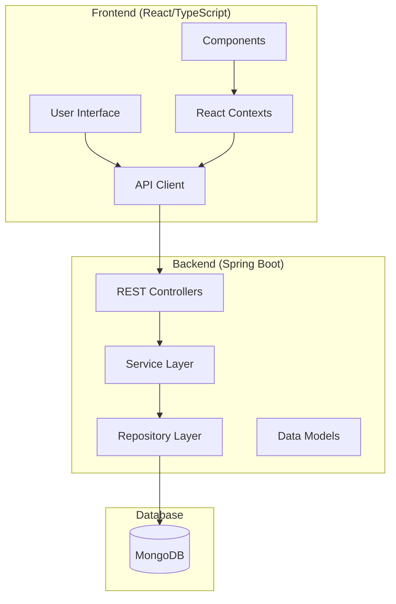
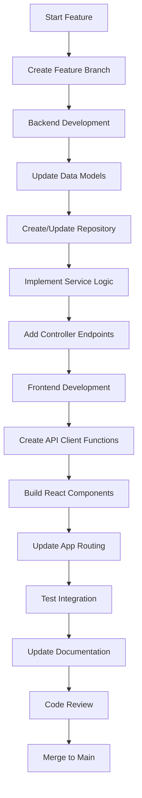
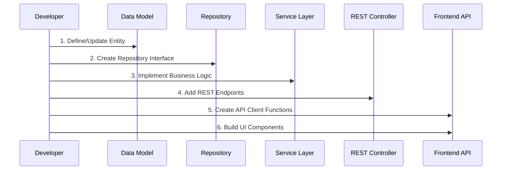
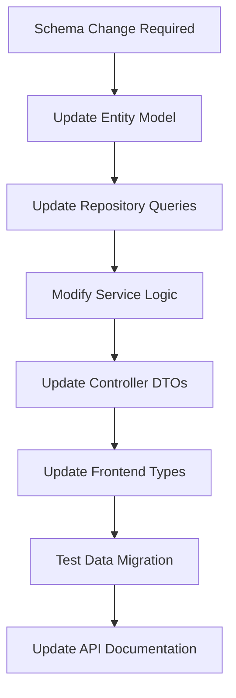
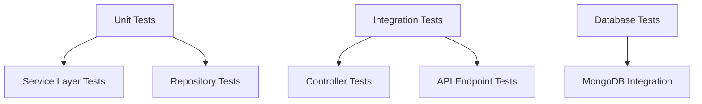

# Developer Guide - Event Planning Application

## Overview

This guide provides comprehensive information for developers working on the Event Planning Application, including code organization, development workflows, and maintenance procedures.

## Architecture Overview



## Code Organization

### Backend Structure (`backend/`)

```
backend/
├── src/main/java/com/eventplanning/
│   ├── EventPlanningApplication.java    # Main Spring Boot application
│   ├── config/
│   │   └── SecurityConfig.java          # Security & CORS configuration
│   ├── controller/
│   │   └── EventPlanningController.java # Single REST controller
│   ├── model/                           # Data entities
│   │   ├── User.java
│   │   ├── Event.java
│   │   ├── RSVP.java
│   │   ├── Task.java
│   │   └── Budget.java
│   ├── repository/                      # MongoDB repositories
│   │   ├── UserRepository.java
│   │   ├── EventRepository.java
│   │   ├── GuestRepository.java
│   │   ├── TaskRepository.java
│   │   └── BudgetRepository.java
│   └── service/                         # Business logic
│       ├── AuthenticationService.java
│       ├── UserService.java
│       ├── EventService.java
│       ├── GuestService.java
│       ├── TaskService.java
│       └── BudgetService.java
├── src/main/resources/
│   └── application.properties           # Configuration
└── pom.xml                             # Maven dependencies
```

### Frontend Structure (`frontend/`)

```
frontend/
├── src/
│   ├── api/                            # API client modules
│   │   ├── client.ts                   # Axios configuration
│   │   ├── auth.ts                     # Authentication APIs
│   │   ├── events.ts                   # Event APIs
│   │   ├── guests.ts                   # Guest/RSVP APIs
│   │   ├── tasks.ts                    # Task APIs
│   │   └── budget.ts                   # Budget APIs
│   ├── components/                     # React components
│   │   ├── auth/
│   │   │   ├── LoginForm.tsx
│   │   │   ├── RegisterForm.tsx
│   │   │   └── ProtectedRoute.tsx
│   │   ├── events/
│   │   │   ├── EventList.tsx
│   │   │   └── EventForm.tsx
│   │   └── guests/
│   │       └── RSVPForm.tsx
│   ├── contexts/
│   │   └── AuthContext.tsx             # Authentication state
│   ├── App.tsx                         # Main application component
│   └── index.tsx                       # React entry point
├── public/
│   └── index.html                      # HTML template
├── package.json                        # npm dependencies
└── tsconfig.json                       # TypeScript configuration
```

## Development Workflows

### 1. Feature Development Workflow



### 2. API Development Sequence



### 3. Database Schema Changes



## Development Environment Setup

### Prerequisites
- Java 21+
- Node.js 18+
- MongoDB 6.0+
- Maven 3.8+
- Git

### Local Development Setup

1. **Clone Repository**
   ```bash
   git clone <repository-url>
   cd event-planning-app
   ```

2. **Backend Setup**
   ```bash
   cd backend
   mvn clean install
   mvn spring-boot:run
   ```

3. **Frontend Setup**
   ```bash
   cd frontend
   npm install
   npm run dev
   ```

4. **MongoDB Setup**
   ```bash
   # Start MongoDB locally
   mongod --dbpath /path/to/data/directory
   ```

## Code Standards and Conventions

### Backend (Java)

- **Package Naming**: `com.eventplanning.<layer>`
- **Class Naming**: PascalCase (e.g., `EventService`)
- **Method Naming**: camelCase (e.g., `createEvent`)
- **Constants**: UPPER_SNAKE_CASE
- **Annotations**: Use Spring annotations consistently
- **Error Handling**: Throw meaningful exceptions with descriptive messages

### Frontend (TypeScript/React)

- **File Naming**: PascalCase for components (e.g., `EventForm.tsx`)
- **Function Naming**: camelCase
- **Interface Naming**: PascalCase with descriptive names
- **Component Structure**: Functional components with hooks
- **State Management**: React Context for global state
- **API Calls**: Centralized in `/api` modules

## Testing Strategy

### Backend Testing



### Frontend Testing

- **Component Tests**: React Testing Library
- **API Tests**: Mock API responses
- **Integration Tests**: End-to-end user flows
- **Type Safety**: TypeScript compilation

## Common Development Tasks

### Adding a New Entity

1. **Create Model** (`backend/src/main/java/com/eventplanning/model/`)
   ```java
   @Document(collection = "entities")
   public class NewEntity {
       @Id
       private String id;
       // fields, constructors, getters, setters
   }
   ```

2. **Create Repository** (`backend/src/main/java/com/eventplanning/repository/`)
   ```java
   @Repository
   public interface NewEntityRepository extends MongoRepository<NewEntity, String> {
       // custom query methods
   }
   ```

3. **Create Service** (`backend/src/main/java/com/eventplanning/service/`)
   ```java
   @Service
   public class NewEntityService {
       @Autowired
       private NewEntityRepository repository;
       // business logic methods
   }
   ```

4. **Add Controller Endpoints** (`EventPlanningController.java`)
   ```java
   @PostMapping("/api/entities")
   public ResponseEntity<?> createEntity(@RequestBody Map<String, Object> request) {
       // implementation
   }
   ```

5. **Create Frontend API** (`frontend/src/api/newentity.ts`)
   ```typescript
   export const newEntityAPI = {
       create: async (data: CreateRequest): Promise<Entity> => {
           const response = await apiClient.post('/entities', data);
           return response.data;
       }
   };
   ```

### Adding a New UI Component

1. **Create Component** (`frontend/src/components/`)
   ```typescript
   import React from 'react';
   
   const NewComponent: React.FC = () => {
       return <div>Component content</div>;
   };
   
   export default NewComponent;
   ```

2. **Add to App Routing** (`App.tsx`)
3. **Create API Integration**
4. **Add State Management** (if needed)

## Debugging and Troubleshooting

### Backend Debugging

- **Swagger UI**: `http://localhost:8080/swagger-ui.html` - Interactive API documentation and testing
- **API Docs**: `http://localhost:8080/api-docs` - OpenAPI specification
- **Logs**: Check Spring Boot console output
- **Database**: Use MongoDB Compass to inspect data
- **API Testing**: Use Swagger UI, Postman, or curl for endpoint testing
- **Profiling**: Use Spring Boot Actuator for monitoring

### Frontend Debugging

- **Vite Dev Server**: Instant startup and hot module replacement
- **Browser DevTools**: Network tab for API calls, faster refresh with Vite
- **React DevTools**: Component state inspection
- **Console Logs**: Debug API responses and state changes
- **TypeScript Errors**: Check compilation errors in terminal
- **Vite Build Analysis**: Use `yarn build` to analyze bundle size

## Performance Considerations

### Backend Optimization

- **Database Indexing**: Add indexes for frequently queried fields
- **Caching**: Implement Redis for session management
- **Connection Pooling**: Configure MongoDB connection pool
- **Async Processing**: Use `@Async` for long-running operations

### Frontend Optimization

- **Vite Benefits**: Lightning-fast dev server startup and hot reload
- **Code Splitting**: Vite handles automatic code splitting
- **Bundle Analysis**: Use `yarn build` and analyze dist/ output
- **Tree Shaking**: Vite automatically removes unused code
- **Asset Optimization**: Vite optimizes images and static assets

## Security Best Practices

### Backend Security

- **JWT Validation**: Verify tokens on protected endpoints
- **Input Validation**: Sanitize all user inputs
- **CORS Configuration**: Restrict allowed origins
- **Password Hashing**: Use bcrypt for password storage
- **SQL Injection Prevention**: Use parameterized queries

### Frontend Security

- **Token Storage**: Store JWT securely in localStorage
- **XSS Prevention**: Sanitize user-generated content
- **HTTPS**: Use secure connections in production
- **Input Validation**: Validate forms on client side

## Maintenance Tasks

### Regular Maintenance

1. **Dependency Updates**
   ```bash
   # Backend
   mvn versions:display-dependency-updates
   
   # Frontend
   npm update
   npm audit
   ```

2. **Database Maintenance**
   - Monitor MongoDB performance
   - Create database backups
   - Optimize queries and indexes

3. **Log Monitoring**
   - Review application logs
   - Monitor error rates
   - Track performance metrics

### Code Quality

- **Code Reviews**: Mandatory for all changes
- **Static Analysis**: Use SonarQube or similar tools
- **Documentation**: Keep README and guides updated
- **Testing Coverage**: Maintain >80% test coverage

## Deployment Preparation

### Pre-deployment Checklist

- [ ] All tests passing
- [ ] Code reviewed and approved
- [ ] Documentation updated
- [ ] Environment variables configured
- [ ] Database migrations ready
- [ ] Performance testing completed
- [ ] Security scan passed

This guide provides the foundation for maintaining and extending the Event Planning Application. For deployment and operations, refer to the DevOps Guide.