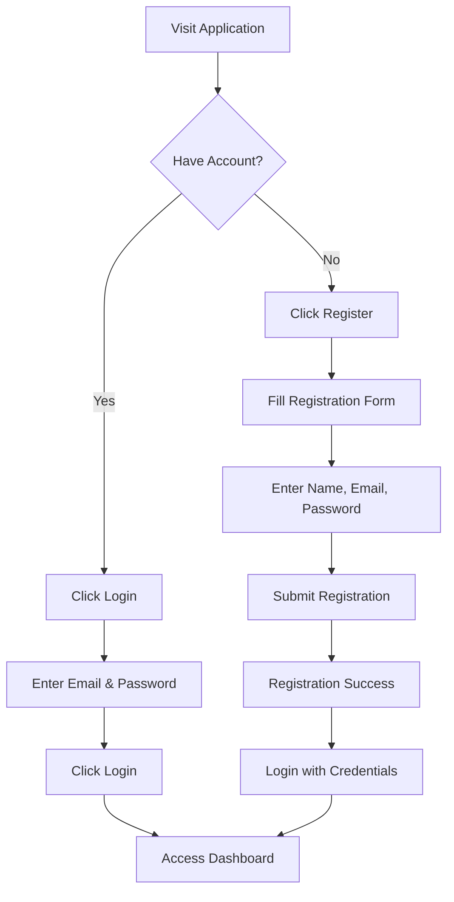
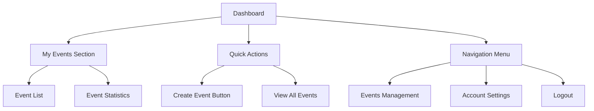
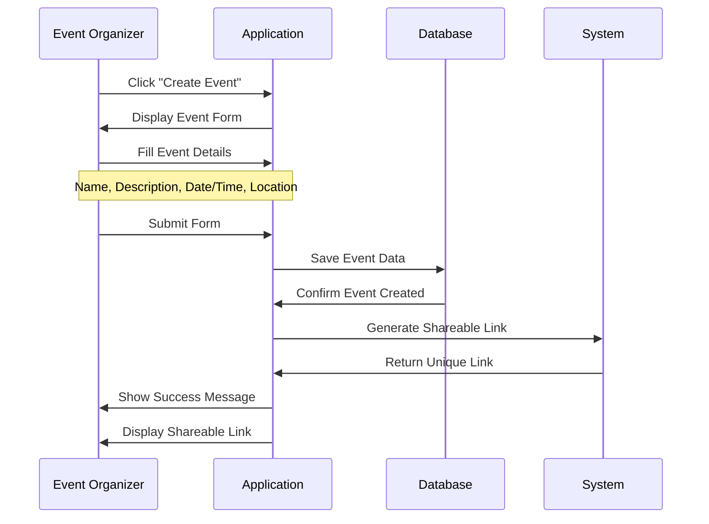
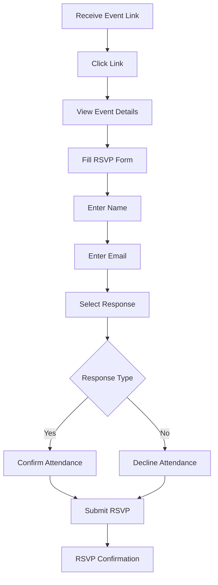
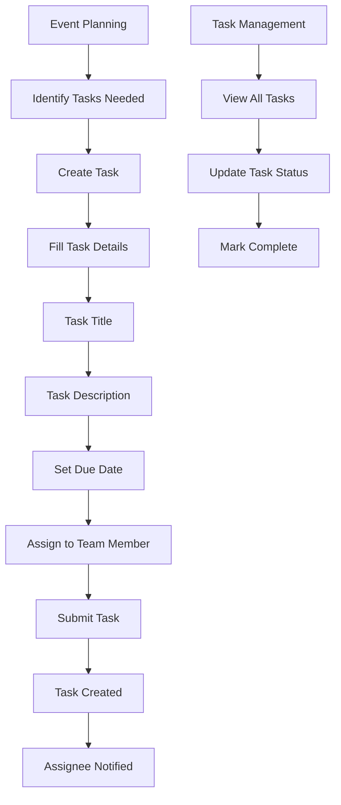
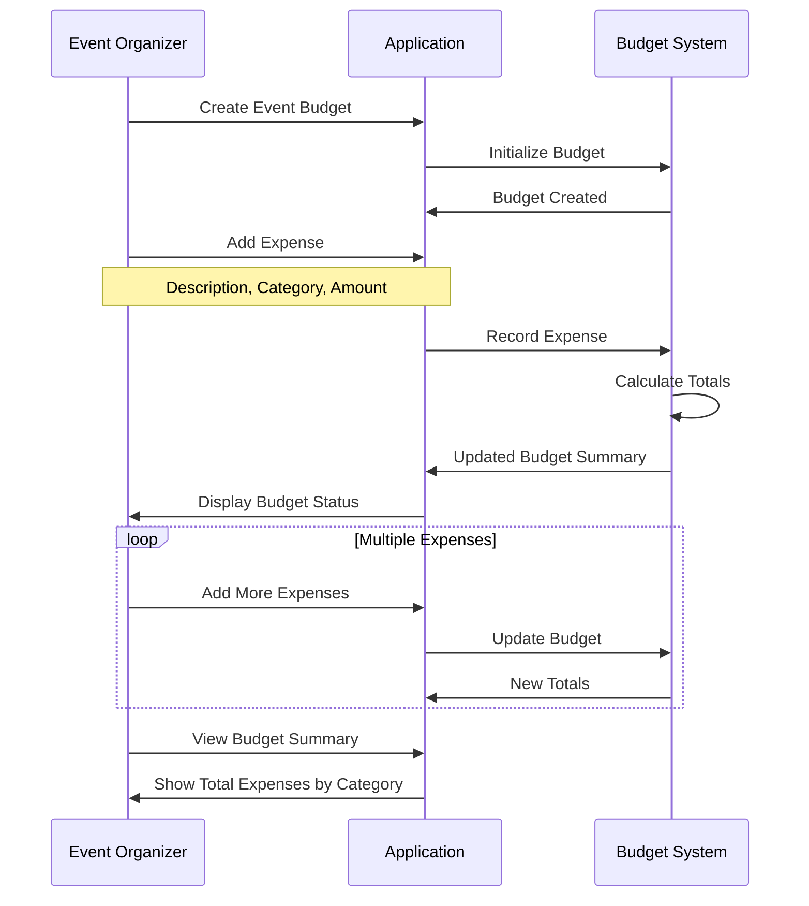
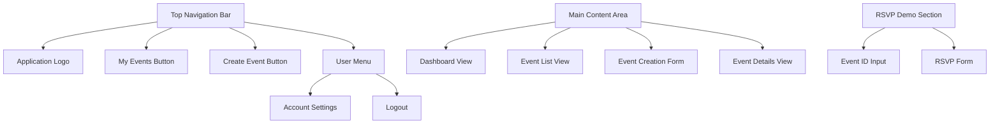
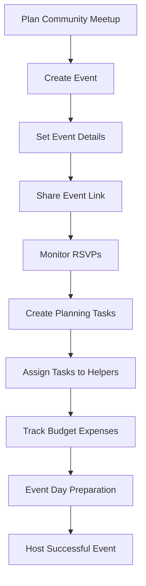
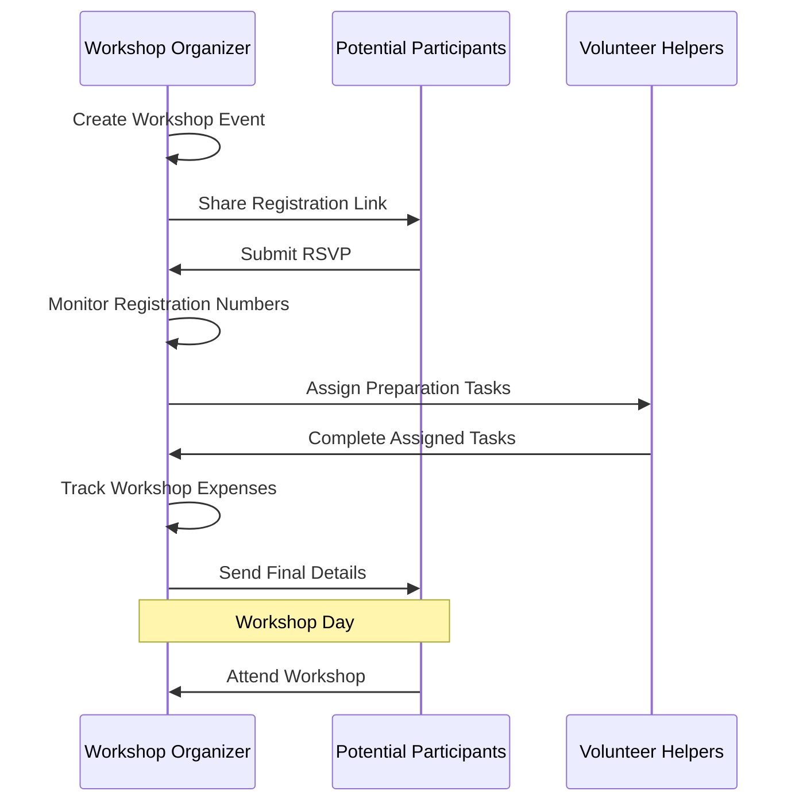

# User Guide - Event Planning Application

## Overview

Welcome to the Event Planning Application! This guide will help you navigate and use all the features available for organizing community events, managing guest lists, tracking RSVPs, assigning tasks, and monitoring budgets.

## Getting Started

### Account Registration and Login

#### Registration Process
1. **Visit the Application**: Open your web browser and go to the application URL
2. **Click Register**: Select the "Register" button in the top navigation
3. **Fill Out Form**:
   - **Name**: Enter your full name
   - **Email**: Provide a valid email address
   - **Password**: Create a secure password
4. **Submit**: Click "Register" to create your account
5. **Login**: Use your credentials to access the application

#### Login Process
1. **Click Login**: Select the "Login" button
2. **Enter Credentials**: Provide your email and password
3. **Access Dashboard**: Successfully login to view your events

## Main Features

### Dashboard Overview

The dashboard provides:
- **My Events**: Overview of events you've created
- **Quick Actions**: Fast access to common tasks
- **Navigation**: Easy access to all features

## Event Management

### Creating an Event

#### Step-by-Step Event Creation

1. **Access Event Creation**
   - Click "Create Event" button from dashboard
   - Or use the navigation menu

2. **Fill Event Information**
   - **Event Name**: Choose a descriptive title
   - **Description**: Provide event details and agenda
   - **Date & Time**: Select when the event will occur
   - **Location**: Specify where the event will take place

3. **Submit Event**
   - Review all information for accuracy
   - Click "Create Event" to save

4. **Share Your Event**
   - Copy the generated shareable link
   - Send to potential attendees via email, social media, etc.

### Managing Your Events

#### Viewing Events
- **My Events**: See all events you've organized
- **Event Details**: Click on any event to view full information
- **Guest Lists**: Monitor who has RSVP'd to your events

#### Event Information Display
Each event shows:
- Event name and description
- Date, time, and location
- Shareable link for invitations
- Current RSVP count (when available)

## RSVP System

### Attending an Event (Guest Perspective)

#### RSVP Process for Guests

1. **Receive Invitation**
   - Get shareable link from event organizer
   - Link can be shared via email, text, social media

2. **View Event Details**
   - Click the shared link
   - Review event information (name, date, time, location, description)

3. **Submit RSVP**
   - Enter your name and email address
   - Select your response:
     - **Yes**: You will attend the event
     - **No**: You cannot attend the event
   - Click "Submit RSVP"

4. **Confirmation**
   - Receive confirmation message
   - Your response is recorded for the organizer

### Managing Guest Responses (Organizer Perspective)

#### Viewing Guest Lists
- Access through event details
- See all RSVP responses
- View guest names and email addresses
- Monitor attendance numbers

#### RSVP Summary
- **Yes Responses**: Number of confirmed attendees
- **No Responses**: Number of declined invitations
- **Total Responses**: Overall RSVP count

## Task Management

### Creating and Assigning Tasks

#### Task Creation Process

1. **Access Task Management**
   - Navigate to specific event
   - Look for task management section

2. **Create New Task**
   - Click "Create Task" or similar button
   - Fill in task information:
     - **Title**: Brief description of the task
     - **Description**: Detailed task requirements
     - **Due Date**: When the task should be completed
     - **Assignee**: Who will complete the task

3. **Task Assignment**
   - Assign to yourself or team members
   - Tasks appear in assignee's task list

#### Managing Task Status

**Task Statuses**:
- **Pending**: Task created but not started
- **In Progress**: Task is being worked on
- **Completed**: Task is finished

**Updating Tasks**:
- View your assigned tasks
- Update status as work progresses
- Mark tasks complete when finished

## Budget Management

### Budget Tracking Workflow

#### Setting Up Event Budget

1. **Create Budget**
   - Navigate to your event
   - Access budget management section
   - Initialize budget for the event

2. **Add Expenses**
   - Click "Add Expense"
   - Enter expense details:
     - **Description**: What the expense is for
     - **Category**: Type of expense (venue, catering, supplies, etc.)
     - **Amount**: Cost of the expense

3. **Track Spending**
   - View total expenses
   - See breakdown by category
   - Monitor budget throughout event planning

#### Budget Categories
Common expense categories include:
- **Venue**: Location rental costs
- **Catering**: Food and beverage expenses
- **Supplies**: Materials and equipment
- **Marketing**: Promotion and advertising
- **Entertainment**: Speakers, performers, activities
- **Miscellaneous**: Other event-related costs

## User Interface Navigation

### Main Navigation Elements

### Navigation Tips

1. **Top Navigation**: Always visible for quick access to main features
2. **My Events**: View and manage all your created events
3. **Create Event**: Quick access to event creation form
4. **User Menu**: Access account settings and logout
5. **RSVP Demo**: Test RSVP functionality with event IDs

## Common Use Cases

### Use Case 1: Organizing a Community Meetup

**Scenario**: You want to organize a local tech meetup

1. **Create the Event**
   - Name: "Monthly Tech Meetup - January"
   - Description: "Join us for networking and tech talks"
   - Date/Time: Next Friday, 6:00 PM
   - Location: "Community Center, Main Street"

2. **Share with Community**
   - Copy the shareable link
   - Post on social media, forums, email lists
   - Send to regular attendees

3. **Manage Responses**
   - Monitor RSVP responses
   - Plan for confirmed attendee count
   - Follow up with interested participants

4. **Plan Event Tasks**
   - Create task: "Book venue" (assign to yourself)
   - Create task: "Arrange refreshments" (assign to helper)
   - Create task: "Set up AV equipment" (assign to tech volunteer)

5. **Track Expenses**
   - Add venue cost to budget
   - Track refreshment expenses
   - Monitor total spending

### Use Case 2: Planning a Workshop

**Scenario**: Educational workshop with limited capacity

1. **Event Setup**
   - Create workshop with detailed description
   - Include prerequisites and what attendees will learn
   - Set capacity expectations in description

2. **Registration Management**
   - Share link with target audience
   - Monitor RSVP responses
   - Track attendance numbers

3. **Preparation Tasks**
   - "Prepare workshop materials" - assign to yourself
   - "Set up room layout" - assign to venue coordinator
   - "Test presentation equipment" - assign to tech helper

4. **Budget Tracking**
   - Materials and supplies
   - Venue costs (if applicable)
   - Refreshment expenses

## Tips for Success

### Event Organization Best Practices

1. **Clear Event Descriptions**
   - Include all relevant details
   - Specify what attendees should bring or expect
   - Provide contact information for questions

2. **Effective Task Management**
   - Break large tasks into smaller, manageable pieces
   - Set realistic due dates
   - Assign tasks to reliable team members

3. **Budget Management**
   - Track all expenses as they occur
   - Use descriptive categories
   - Review budget regularly during planning

4. **Guest Communication**
   - Share event links through multiple channels
   - Follow up with potential attendees
   - Send reminders as event date approaches

### Troubleshooting Common Issues

#### RSVP Problems
- **Issue**: Guests can't access event
- **Solution**: Verify shareable link is correct and complete

#### Task Management Issues
- **Issue**: Tasks not showing up
- **Solution**: Ensure tasks are properly assigned and saved

#### Budget Tracking Problems
- **Issue**: Expenses not calculating correctly
- **Solution**: Verify all amounts are entered as numbers

## Getting Help

### Support Resources

1. **Application Help**
   - Look for help text within the application
   - Check for tooltips and guidance messages

2. **Common Questions**
   - Review this user guide for detailed instructions
   - Check FAQ sections if available

3. **Technical Issues**
   - Try refreshing your browser
   - Clear browser cache if experiencing problems
   - Ensure JavaScript is enabled

### Contact Information

For technical support or questions about using the application:
- Check the application's help section
- Contact your system administrator
- Report bugs or issues through appropriate channels

This guide covers all the essential features of the Event Planning Application. With these tools, you can successfully organize and manage community events, track attendance, coordinate tasks, and monitor budgets effectively.